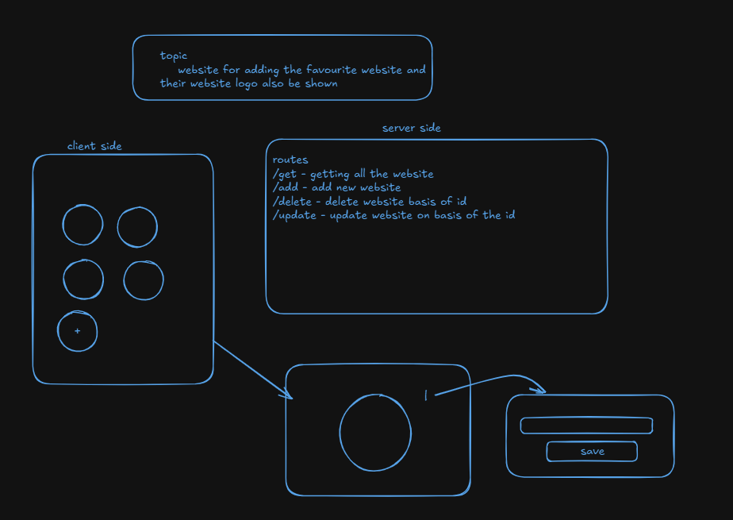
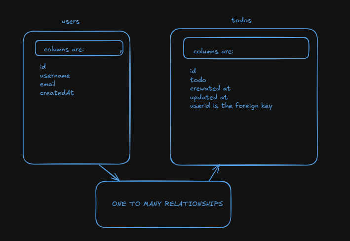
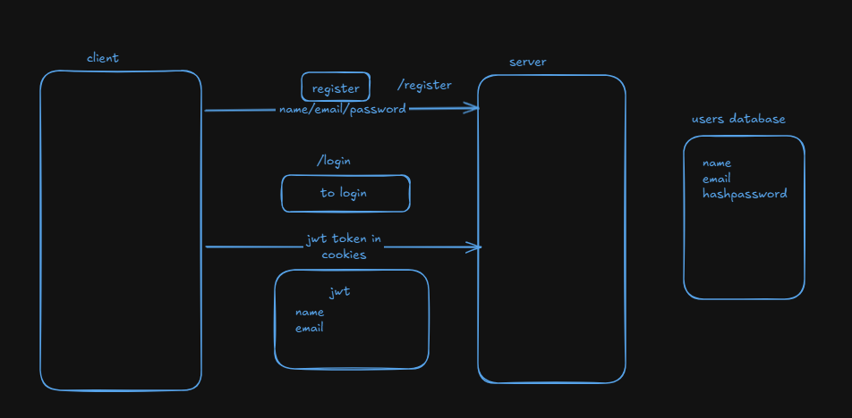

## favourite website collection(favsite)
- This website helps to store the favourite website with edit feature and also shows the logo of theat website
- Run the development server using `npm run dev`.
```bash
git clone https://github.com/david-rai/favsite.git
npm install
npm run dev
```

## TECHNOLOGIES
- FRONTEND (react,vite)
- DATABASE (mysql with mysql2 driver)
- BACKEND (nodejs with express for routing)

# sign up page






